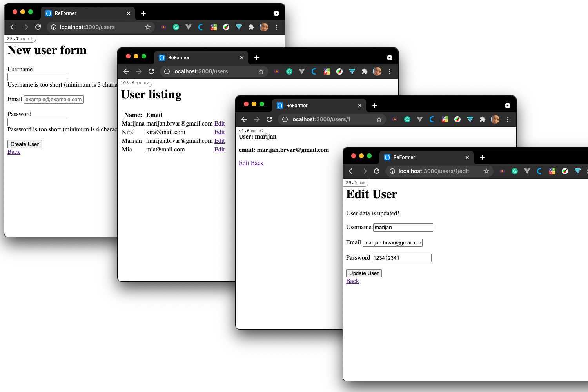

# Bare Metal Forms and Helpers

> Gradually replace HTML form with Rails functionality

In this project, we have the opportunity to gradually learn and understand how to change HTML form
with Ruby on Rails provided methods. From creating the layout, adding fields with the ability
to validate entered data, and finally saving and editing saved data.

## Built With

- Ruby
- Ruby on Rails
- SQLite3

## Getting Started
1. Clone this project by entering the following command in your terminal `git clone git@github.com:marijanbrvar/re-former.git`
2. Change to the directory and run bundler `bundle install.`
3. Initialize your local database by running `rails db:create` and then `rails db:migrate`
4. Run your rails server `rails s`

### Prerequisites
- Git
- Ruby
- Ruby on Rails
- Bundler

### Usage
1. Add your user data to the repository by filling in a simple web form.
You can access the web form `http://localhost:3000/users/new` or
press the new button under the User listing page.

## Authors

👤 MARIJAN BRVAR

- GitHub: [@githubhandle](https://github.com/marijanbrvar)
- Twitter: [@twitterhandle](https://twitter.com/marijanbrvar)
- LinkedIn: [LinkedIn](https://linkedin.com/in/marijanbrvar)

## 🤝 Contributing

Contributions, issues, and feature requests are welcome!

Feel free to check the [issues page](issues/).

## Show your support

Give a ⭐️ if you like this project!

## 📝 License

- This project is [MIT](https://opensource.org/licenses/MIT) licensed.
- This project is [creativecommons](https://creativecommons.org/licenses/by-nc/4.0/) licensed.
